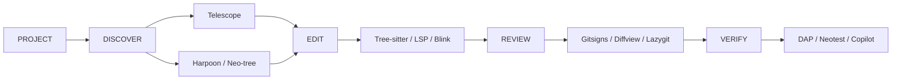

<div align="center">
<pre align="center">
 ███╗   ██╗███████╗ ██████╗ ██╗   ██╗██╗███╗   ███╗
 ████╗  ██║██╔════╝██╔═══██╗██║   ██║██║████╗ ████║
 ██╔██╗ ██║█████╗  ██║   ██║██║   ██║██║██╔████╔██║
 ██║╚██╗██║██╔══╝  ██║   ██║╚██╗ ██╔╝██║██║╚██╔╝██║
 ██║ ╚████║███████╗╚██████╔╝ ╚████╔╝ ██║██║ ╚═╝ ██║
 ╚═╝  ╚═══╝╚══════╝ ╚═════╝   ╚═══╝  ╚═╝╚═╝     ╚═╝
</pre>
<h1>NEOVIM // TERMINAL-BASED DEVELOPMENT SETUP</h1>
<p>LazyVim core · Lua configuration · terminal-first workflow</p>
<p>
  
  
  
</p>
</div>

## EDITOR PIPELINE



## PLUGIN FIELD NOTES

### 01 / Telescope

Telescope is the project discovery and fuzzy-selection layer. Its pickers unify file lookup, live grep, open buffers, symbols, and current-buffer search.

- Root-aware searches use the detected project root, falling back to the current working directory.
- File discovery uses `fd`; grep uses ripgrep, includes hidden files, and excludes `.git` and `node_modules`.
- FZF-native improves fuzzy ranking. Search state also supports case-sensitive and whole-word matching.

**Lua excerpt · project grep**

```lua
require("telescope.builtin").live_grep({
  cwd = LazyVim.root() or vim.uv.cwd(),
  additional_args = { "--hidden", "--glob=!.git", "--glob=!node_modules" },
})
```

---

### 02 / Harpoon

Harpoon keeps a small, persistent working set beside Telescope's broad search. This configuration automatically collects eligible files and makes them available through numbered slots and sequential navigation.

- A `BufEnter` callback adds named, listed file buffers while skipping special and unnamed buffers.
- `save_on_toggle` and `sync_on_ui_close` preserve the list as its menu opens and closes.
- Numbered selections suit recurring transitions between source, tests, and configuration files.

**Lua excerpt · list lifecycle**

```lua
local harpoon = require("harpoon")
harpoon:setup({ settings = { save_on_toggle = true, sync_on_ui_close = true } })
harpoon:list():add()
harpoon:list():select(1)
```

---

### 03 / Neo-tree

Neo-tree is the persistent filesystem view. It complements fuzzy search with a navigable directory hierarchy, live file updates, and Git state rendered beside project entries.

- Dotfiles, ignored files, and Git-ignored files remain visible for full workspace inspection.
- The current buffer is revealed automatically, and opened directories stay expanded.
- A libuv watcher refreshes the tree when files change outside Neovim; Mini Icons supplies file glyphs.

**Lua excerpt · filesystem behavior**

```lua
filesystem = {
  filtered_items = { visible = true, hide_dotfiles = false, hide_gitignored = false },
  follow_current_file = { enabled = true, leave_dirs_open = true },
  use_libuv_file_watcher = true,
}
```

---

### 04 / nvim-treesitter

Tree-sitter parses source into syntax trees, giving language-aware features structural information beyond token matching. LazyVim manages the core integration; this setup also enables Treesitter Context for the active code scope.

- Structural parsing improves highlighting around nested expressions and language constructs.
- Parser behavior is supplied by LazyVim rather than a separate local plugin override.
- Neovim's Lua API can start highlighting for a buffer and language explicitly.

**Lua API example · start highlighting**

```lua
vim.treesitter.start(0, "lua")
```

---

### 05 / LSP + Mason

The Language Server Protocol provides semantic editor features; Mason manages installation of the configured servers and supporting tools. Together they connect navigation and diagnostics to language-specific analyzers instead of plain-text search.

- Configured coverage includes TypeScript, JavaScript, Go, Python, C#, HTML, CSS, JSON, YAML, and Tailwind.
- LSP features include definitions, references, rename, diagnostics, code actions, and TypeScript inlay hints.
- Mason's ensure list keeps servers, formatters, and linters available across projects.

**Lua excerpt · managed tools**

```lua
opts = {
  ensure_installed = { "gopls", "goimports", "omnisharp", "prettier" },
}
```

---

### 06 / Blink.cmp

Blink.cmp provides the completion UI and signature help used while editing. The local configuration makes suggestions and documentation appear automatically, reducing the need to leave the current expression to inspect an API.

- Completion menus open automatically and show documentation after a short delay.
- Signature help displays parameter information in a bordered window.
- Ghost text is disabled in Blink and `nvim-cmp`, keeping Copilot's inline suggestion layer distinct.

**Lua excerpt · completion presentation**

```lua
opts.completion.menu = { auto_show = true }
opts.completion.documentation = { auto_show = true, auto_show_delay_ms = 150 }
opts.signature = { enabled = true }
```

---

### 07 / Gitsigns + Diffview

These tools cover different scales of code review. Gitsigns annotates the current buffer and exposes individual change hunks; Diffview opens repository and file history in dedicated side-by-side layouts.

- Current-line blame is rendered at the end of the line after a short delay.
- Hunks can be previewed, staged, reset, and traversed without staging the entire file.
- Diffview uses a horizontal two-panel layout for changes and a three-panel layout for merges.

**Lua excerpt · review options**

```lua
local gitsigns_opts = {
  current_line_blame = true,
  current_line_blame_opts = { virt_text_pos = "eol", delay = 400 },
}
local diffview_opts = { view = { default = { layout = "diff2_horizontal" } } }
```

---

### 08 / Lazygit

Lazygit is a terminal Git application, launched through LazyVim's native Snacks integration. It provides a full repository workflow without turning the Neovim buffer itself into a status interface.

- The integration opens against the project root, keeping repository context consistent with search and navigation.
- Its terminal UI organizes working-tree changes, staging, branches, commits, and history.
- It complements Gitsigns and Diffview: use those for inline edits and visual comparisons, and Lazygit for broader repository operations.

**Lua API example · open the Git interface**

```lua
Snacks.lazygit()
```

---

### 09 / nvim-dap + Neotest

nvim-dap coordinates Debug Adapter Protocol sessions; Neotest provides a shared test interface. The configured adapters bridge test and debugger workflows across JavaScript, TypeScript, Go, and .NET.

- DAP configurations cover launch and attach flows, breakpoints, scopes, and variable inspection.
- JavaScript debugging uses VS Code's `js-debug`; Go uses Delve; .NET uses `netcoredbg`.
- Neotest adapters cover Vitest, Jest, Go, and .NET, including test-focused debugging integration.

**Lua excerpt · adapter registration**

```lua
opts.adapters = {
  require("neotest-vitest"),
  require("neotest-go")({ recursive_run = true }),
}
```

---

### 10 / Copilot + CopilotChat

Copilot provides inline completions; CopilotChat adds a tool-aware conversation panel. Its modes separate ordinary questions, read-only planning, approval-based agent work, and trusted Autopilot actions.

- Inline suggestions use the binary server and trigger automatically while editing.
- Plan mode limits tools to workspace reads; Agent asks before actions, while Autopilot trusts selected workspace and shell tools.
- In VS Code, chat delegates to the native client. Standalone Neovim uses CopilotChat and can load installed skills as prompts.

**Lua excerpt · read-only Plan mode**

```lua
Plan = {
  tools = { "file", "buffer", "glob", "grep", "gitdiff", "selection" },
  trusted_tools = { "file", "buffer", "glob", "grep", "gitdiff", "selection" },
}
```

---

Exact keys and task workflows live in the [Neovim + tmux cheatsheet](NVIM-CHEATSHEET.md).
